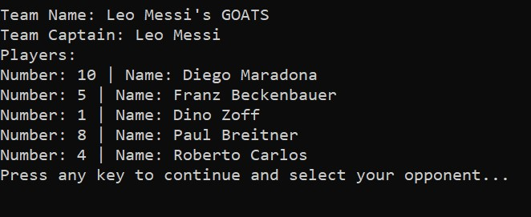

# Football Shootout

## A five-a-side football simulation

**Football Shootout** is a fun and compact football simulation game that allows the user to have their shot at glory.

## GitHub Repository

***

[T1A3_Terminal_Application](https://github.com/simon-tanna/T1A3_Terminal_Application)

## System Requirements

***

Football Shootout is designed to work in any terminal workspace that has the Ruby progamming lanuage installed. If you want to play football shootout but do not have Ruby on your device, you can **[click here](https://rvm.io/rvm/install)** to get instructions on how to install Ruby.

## Instructions

***

To run **Football Shootout** you need to open the terminal application on your device and open the root directory containing the program files.

Enter this command

    ./run_app.sh

Then enter your first and last name (eg. if your name is Leo Messi)

    ./run_app.sh Leo Messi

Execute the command which will install any required Ruby gem files and then enter the program.

## Contents

***

* [1. Software Development Plan](#1-software-development-plan)
  * [1.1 Overview](#11-overview)
  * [1.2 Why a Football Sim?](#12-why-a-football-sim)
  * [1.3 Target Audience](#13-target-audience)
  * [1.4 App Usage](#14-app-usage)
  * [1.5 Ruby Gems](#15-ruby-gems)
* [2. Features](#2-features)
  * [2.1 The Coin Toss](#21-the-coin-toss)
  * [2.2 The Team Information Menu](#22-the-team-information-menu)
  * [2.3 Team Creation](#23-team-creation)
  * [2.4 Extra Time](#24-extra-time)
* [3. User Interaction](#3-user-interaction)
  * [3.1 Command Line Arguments](#31-command-line-arguments)
  * [3.2 Main Menu](#32-main-menu)
    * [3.2.1 Rules](#321-rules)
    * [3.2.2 View Team Details](#322-view-team-details)
    * [3.2.3 Main Game](#323-main-game)
    * [3.2.4 Exit Game](#324-exit-game)
* [4. Control Flow Diagram](#4-control-flow-diagram)
* [5. Data Flow Diagram](#5-data-flow-diagram)
* [6. Project Management](#6-project-management)

## 1. Software Development Plan

***

### 1.1 Overview

This application is a simple yet fun game designed to simulate a real match experience for the user. Maximum enjoyment of using the application is the ultimate aim of this app.

The user is able to view the rules of the game and view the team details via different menu options before entering the match menu.

They are able to select a team that they will control and select the team controlled by the application before participating in a coin toss to determine who will kick-off. There are 5 phases of play in the match where the user can choose a team action which results in a goal or a turn-over of posession.

If the scores are even after the 5 phases of play, the match enters extra-time whereby the user has one last chance to secure victory! This match experience can be repeated as many times as the user wants.

### 1.2 Why a Football Sim?

This game has been created to solve the question of who is the best randomly generated 5-a-side football team in a digital environment. Football is the world game and everybody loves to win at sport and games. This application will return a winner and therefore resolve the afore mentioned question... **Who is the best?**

### 1.3 Target Audience

Football Shootout is aimed to provide entertainment for anyone who needs to waste some time and is appropriate for all age groups. The user does not need to have any knowledge of the rules of football to play as the rules are available in the main menu.

### 1.4 App Usage

The user will interact with elements of Football Shootout by means of text input (eg. entering the team name) and selection prompts created by the tty-prompt Ruby gem. Each selection will return a response based upon a randomly generated variable and ultimately decide who winse the game.

### 1.5 Ruby Gems

The following Ruby Gems are to be used in the application:

* [bundler](https://github.com/rubygems/rubygems/) - This gem is used to collate, manage and install other Ruby gems used by the program. It provides a fast and efficent method of installing all required gems for the user upon launch of the game via the run_app.sh file.

* [tty-prompt](https://github.com/piotrmurach/tty-prompt/) - 'tty-prompt' is used to create simple and error free selection options for the user of the application. The selected options will directly impact the in-game result, therefore this gem is considered to be essential to the operation of Football Shootout.

* [colorize](https://github.com/fazibear/colorize/) - In order to make the terminal interface engaging and to add meaning to elements of on screen text, 'colorize' has been implemented throughout the game

* [tty-progressbar](https://github.com/piotrmurach/tty-progressbar) - The developer is using 'tty-progressbar' to create heigtened sense of anticipation to the user experience.

* [faker](https://github.com/faker-ruby/faker/) - 'faker' is being used to create a fresh roster of players for the bot teams at each game launch. Its implementation is designed to give the user a unique experienve each time they play.

* [artii](https://github.com/miketierney/artii/) - In order to present a visually engaging text for the user, 'artii' is used to convert plain text to ascii art on screen.

* [tty-font](https://github.com/piotrmurach/tty-font) - 'tty-font' is to be used on the occassion when a smaller ascii font is required.

## 2. Features

***

### 2.1 The Coin-Toss

In order to determine which team kicks off and gains the advantage of an extra attack, a simple coin toss function has been built into the app.
Each team in the Teams class features a coin toss variable which is populated with a random selection of either "heads" or "tails" (code below).

    team_1_toss = ["heads", "tails"].sample
    team_2_toss = ["heads", "tails"].sample
    team_3_toss = ["heads", "tails"].sample
    team_4_toss = ["heads", "tails"].sample

After a user selects their team and proceeds to the coin toss part of the game, the selection they make will return a true or false answer matched against the randomly assigned coin toss variable of their team. Depending whether the answer is true or false, an 'if-else' loop determines if the user team will have posession of the ball or defend (code below).

    if toss == user_team.toss
        puts "You have won the toss... Prepare to kick off!"
    ..
    ..
    ..
    else
        puts "You lost the toss. #{bot_team} to kick off"
    ..
    end

Ruby gem TTY-prompt was used to present the user with the "heads" or "tails" choice so no error handling was required in this case.

### 2.2 The Team Information Menu

In order for the user to know what players they will have on their team and what football superstars they will potentially be facing, a simple team information menu option has been included as part of the main game menu.
The array of 5 players within the Player class was built using the the Ruby gem "faker" to ensure a unique user experience with every launch of the application.
Ruby gem TTY-prompt was also used to allow the user to select each team but in order to demonstrate error handling protocols within the app, the user is asked to manually enter an option to exit the selected team information screen. An ArgumentError is raised with retry if the user does not enter a response and a Standard Error message is raised with retry enters an invalid response (code below)

    begin
    puts "Would you like to view another team? (press 'y' then enter to view another team. press 'n' then enter to return to the main menu"
    to_info = gets.chomp
        if to_info != "n" && to_info != "y"
            raise StandardError
        end
        if to_info == ""
            raise ArgumentError
        end
        rescue ArgumentError
            system "clear"
            puts "You didn't enter an option! Please select 'y' or 'n' before pressing enter"
            retry
        rescue StandardError
            system "clear"
            puts "You didn't enter a valid option! Please select 'y' or 'n' before pressing enter"
            retry
        end
    end

Integrity of the user experience is ensured by using the error rescue and retry functions by eliminating the possibility of the wrong result being returned from a given user input.

### 2.3 Team Creation

Upon the start of the main game, the user is prompted to create a team of legends. They will name the team and then proceed to select 5 players. This team is built using the same variables featured in the Teams class. The truthy or falsey values of each attacking, defensive and extra time phase are generated within the create_team method (code below)

    def create_team(prompt,game,player_name,ascii_slant)
    puts ascii_slant.asciify("Create Your").colorize(:red)
    puts ascii_slant.asciify("Team of Legends!").colorize(:red)
    team_name = ""
    captain = "#{player_name}"
    team_new_players = []
    team_new_toss = ["heads", "tails"].sample
    team_attack_1 = ["pass", "shoot"].sample
    team_attack_2 = ["dribble then shoot", "shoot from range"].sample
    team_attack_3 = ["pass", "shoot"].sample
    team_defend_1 = ["slide tackle", "block tackle"].sample
    team_defend_2 = ["slide tackle", "block tackle"].sample
    team_defend_3 = ["slide tackle", "block tackle"].sample
    team_extra = ["shoot left", "shoot right"].sample
    choice_1 = Player.new("Pele", 10), Player.new("Diego Maradona", 10)
    choice_2 = Player.new("Bobby Moore", 6), Player.new("Franz Beckenbauer", 5)
    choice_3 = Player.new("Lev Yashin", 1), Player.new("Dino Zoff", 1)
    choice_4 = Player.new("Didier Deschamps", 7), Player.new("Paul Breitner", 8)
    choice_5 = Player.new("Cafu", 2), Player.new("Marco Tardelli", 14)
    begin
    puts "What would you like to call your team?"
    team_name = gets.chomp
        if team_name == ""
            raise ArgumentError
        end
        rescue ArgumentError
            system "clear"
            puts "You didn't enter a team name. Please try again!"
            retry
        end
    puts "Select your legends"
    team_new_players << prompt.select("Choose your star striker: ", choice_1)
    team_new_players << prompt.select("Choose your defensive rock: ", choice_2)
    team_new_players << prompt.select("Choose your iron-gloved goalkeeper: ", choice_3)
    team_new_players << prompt.select("Choose your midfield general: ", choice_4)
    team_new_players << prompt.select("Choose your rampaging full-back: ", choice_5)
    team_user = Teams.new(team_name, team_new_players, 0, captain, team_new_toss, team_attack_1, 
                team_attack_2, team_attack_3, team_defend_1, team_defend_2, team_defend_3, team_extra)
    end

Upon the selection of the players, the team information is printed for the user before continuing to the select opponent screen.

### 2.4 Extra Time

The feature of Extra Time when the team scores are tied is important to the operation of the game as it returns an overall winner and therefore resolves the problem of who is the best 5-a-side football team!
It's operation is invoked if the user team score variable is equal to the bot team score variable. Because this game has been made with the aim of maximising user enjoyment, it is the user who has the opportunity to seal the win and glory for their team. They are presented with a choice: shoot left or shoot right? The true variable for this choice is generated randomly upon the game launch and is passed into the Team class (code below).

    team_extra = ["shoot left", "shoot right"].sample

    team_1 = Teams.new("Barons", team_1_players, 0, team_1_captain, team_1_toss, team_attack_1, team_attack_2, team_attack_3, team_defend_1, team_defend_2, team_defend_3, team_extra)

If the user selects the true variable, they are crowned champions otherwise the bot team regains possession of the ball and scores at the other end of the pitch to win the game for the opposition.
To build this feature, an if-else statement was used nested within the parent while loop (code below).

    while user_team.score == bot_team.score
        puts "The scores are as follows..."
        sleep(1.5)
        puts "#{user_team}: #{user_team.score}"
        sleep(1.5)
        puts "#{bot_team}: #{bot_team.score}"
        sleep(1.5)
        puts "The scores are level..."
        sleep(1.5)
        system "clear"
        puts ascii_slant.asciify("Extra-Time!!!")
        sleep(2)
        puts "The referee decides that #{user_team} have been the better behaved team and awards you the kick-off!".colorize(:blue)
        sleep(1.5)
        puts "PEEP! The referee's whistle blows and your team is immediately on the attack".colorize(:green)
        extra_time_choice = team_extra_time(prompt,game,user_team,bot_team)
        # This is returns an extra-time result from the user input
        if extra_time_choice == user_team.extra
            user_team.score += 1
            puts ascii.asciify("GOAL!!!").colorize(:green)
            sleep(1.5)
            puts ascii.asciify("#{user_team}").colorize(:green)
            puts ascii.asciify("HAVE SCORED").colorize(:green)
            sleep(2)
        else
            system "clear"
            bot_team.score += 1
            puts "The goalkeeper saves!".colorize(:red)
            sleep(1.5)
            puts "He spots his striker unmarked upfield and boots the ball towards him."
            sleep(1)
            puts "The opposition striker controls the ball...."
            sleep(1.5)
            puts "He spots your goalkeeper off his line and takes a long-range snapshot..."
            sleep(2)
            puts ascii_slant.asciify("GOAL!").colorize(:red)
            sleep(2)
            puts ascii_slant.asciify("#{bot_team}").colorize(:red)
            puts ascii_slant.asciify("Have scored...").colorize(:red)
            sleep(2)
        end
    end

## 3. User Interaction

***

### 3.1 Command Line Arguments

The user is asked in the instructions to enter their first and last name as arguments when launching the game. If use this function, it will create a personalised in-game experience where their name will be used on the launch screen and as the "Captain" of thier created team.

    ./run_app.sh Leo Messi

If the user chooses not to pass their name into the command line, a default "Football Fan" name will be displayed instead.

### 3.2 Main Menu

The main menu consists of the following four options

### 3.2.1 Rules

Within this menu option the user shall view a description of how the game will run. It contains a description of team creation, coin toss, game phases and extra-time.

### 3.2.2 View Team Details

The View Team Details option provides the user with the opportunity to view the player roster for each of the bot teams and will therefore be able to make an informed choice when choosing an opponent.

Upon viewing the selected team, the user is asked if they would like to view another team and presented with a 'y' or 'n' (return to main menu) option. Error handling has been written into the code to ensure integrity of flow within the app. If the user does not enter a response or a characher other than 'y' or 'n', the following error will be returned.

    You didn't enter a valid option! Please select 'y' or 'n' before pressing enter

### 3.2.3 Main Game

When selecting the '3' the user is immediately asked to enter a name for their team. If no response is entered, the following error displays until a name is entered.

    You didn't enter a team name. Please try again!
    What would you like to call your team?

The user is then prompted to select 5 legendary players to populate the team roster.

Ruby gem tty-prompt was used to create all user interaction options within the main game as it provides an easy to use and error-free user experience.

Once the team of legends has been created, the user will be prompted to select an opponent from the same list of bot teams viewable within the 'View Team Details" menu option and then proceed to the coin toss. A Ruby gem tty-progressbar animation is used to indicate a coin toss in progress, thereby enhancing the anticipation of the user pending the result.

The football game starts after the coin toss element of the game has been completed with the team who won the toss presented with the first attacking phase of the game. Winning the right to kick-off gives that team a better opportunity of out-scoring the opposition as it means they will have three chances to score a goal whereas the opponent will only get two chances.

In an attacking phase, the user will be presented with an option like the one below.

    Football Fan's GOATS have the ball on the right hand side of the pitch.
    You have a team-mate in a good position outside the box but the opposing goalkeeper is off his line. Do you:  (Press ↑/↓ arrow to move and Enter to select)
        ‣ pass
        shoot

If the user team scores a goal, the following screen will displayed.

If the user team attacking selection results in no goal, the following message is displayed.

In a defending phase, the user will be presented with an option like the one below.

    Prepare to defend!
    Gianluigi Buffon's Barons are looking dangerous and are taking the ball into the final third of the pitch.
    The winger is looking to go past you. Do you:  (Press ↑/↓ arrow to move and Enter to select)
        ‣ slide tackle
        block tackle

If the bot team scores, the following screen featuring the team scores and progress bar is displayed.

If the user selection returns a successful result for the defence, the following message is displayed.

When the scores of the user and bot teams are equal after the 5 phases of play, extra time will be played and the user will have one chance to snatch victory for the team of legends.

If the selected shooting option returns a true value, the player wins otherwise the opposition will win and the following screen is displayed.

### 3.2.4 Exit Game

This option will allow the user to immediately exit the game.

## 4. Control Flow Diagram

***

## 5. Data Flow Diagram

***

## 6. Project Management

***

### [My Trello Board](https://trello.com/b/5awSV5j8/t1a3-terminal-application)

Trello was used as the project management tool to keep the Football Shootout application on track. By using functions such as 'due date' and item check lists, the developer was able to manage workload and priorities effectively. Below is an example of how these elements were implemented.

A screenshot of the Trello board page was made on days when key developments occured while creating the app. These can be found in the documents folder of the application GitHub repository. Below are three examples:

#### **09/12/2021**

#### **12/12/2021**

#### **17/12/2021**

